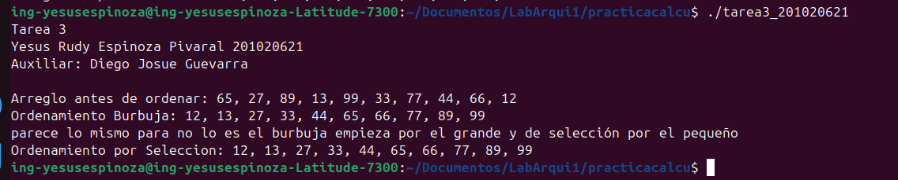

# Laboratorio ACYE1 - Tarea #3: Algoritmos de Ordenamiento en ARM64 Puro

## 👥 Datos del Estudiante
* **Nombre:** Yesus Rudy Espinoza Pivaral
* **Carnet:** 201020621
* **Universidad:** Universidad de San Carlos de Guatemala
* **Facultad:** Ingeniería
* **Escuela:** Ciencias y Sistemas
* **Semestre:** Segundo Semestre 2026
* **Sección:** Laboratorio ACYE1 - A
* **Auxiliar:** Diego Josue Guevarra
* **Ing:** Otto Escobar Leiva
---

## 🎯 1. Marco Formativo y Valores
aplicación de ordenamiento burbuja y por selección no es lo mismo en bajo nivel que alto nivel se maneja con varios registros entre el cpu y la memoria ram.

### 🧠 Competencias Desarrolladas
1. **Apliación de Instrucciones Load/Store (Capítulo 3):** Manipulación de punteros y arreglos contiguos en la memoria RAM mediante registros de 64 bits (`.quad`) y control indexado por hardware (`LSL #3` para desplazamiento de 8 bytes).
2. **Control de Flujo Avanzado:** Implementación de bucles condicionales anidados equivalentes a estructuras de alto nivel (`for` / `while`) utilizando banderas de estado de la ALU y saltos condicionales (`b.ge`, `b.le`, `beq`).
3. **Modularidad y Manejo de la Pila (Capítulo 4):** Resguardo sistemático de registros protegidos (*callee-saved*) utilizando la pila (`stp` / `ldp`) para construir funciones reutilizables que eviten la corrupción del Link Register (`X30`).
4. **todo se realizo en código puro de arm 64 por eso la cantidad de lineas porque no he implementado la función para utilizar algo de C aunque ya seria bajo nivel con trampa pienso yo para el proyecto 2 veremos eso.


---

## 💻 2. Descripción del Programa Principal

El programa está desarrollado completamente en **Ensamblador GNU ARM64 nativo y puro**. Declara un arreglo estático de 10 elementos de 64 bits en la sección `.data`. 

Ejecuta de forma secuencial y modular dos pruebas de rendimiento aritmético:
1. **Prueba ordenamiento burbuja:** Toma la lista desordenada y la ordena de menor a mayor *in-place* en la RAM.
2. **Desorden Dirigido:** Intercambia por hardware el primer y último elemento para forzar trabajo en el segundo algoritmo sin perder los números originales (manteniendo el `12` intacto).
3. **Prueba ordenamiento por salección:** Procesa el arreglo modificado utilizando búsquedas de mínimos absolutos, demostrando la coexistencia de múltiples stack frames en el mismo entorno de ejecución.

Todas las salidas numéricas y de texto se realizan de forma directa al kernel mediante la llamada al sistema **`sys_write` (Syscall 64)**, traduciendo valores binarios a caracteres legibles de la tabla ASCII a mano.

---

## 🛠️ 3. Guía de Compilación y Ejecución

Para compilar este proyecto de forma automática en cualquier sistema Linux ARM64 nativo o emulado (QEMU), utiliza el `Makefile` incluido mediante los siguientes comandos en la terminal integrada de Visual Studio Code:

```bash
# 1. Limpiar archivos binarios previos
make clean

# 2. Ensamblar y enlazar el código en bajo nivel puro
make

# 3. Ejecutar el programa autónomo
./tarea3_201020621
```
## 🖼️ 4. Evidencias de Ejecución y Depuración

### 📺 Resultados en Consola (`sys_write`)
A continuación se muestra la salida limpia del programa en el entorno QEMU ARM64, como queda al final desde consola de linux pero se puede hacer tambien desde la consola de visual studio code.



### 🛡️ Sesión de Depuración en GDB
Evidencia de la sesión de depuración con el breakpoint activo dentro del bucle de ordenamiento, mostrando el estado de los registros y el área de la memoria RAM:

```bash
gdb ./tarea3_201020621
(gdb) break Ordenamiento_Burbuja
(gdb) run
(gdb) info registers
(gdb) x/10gx &arreglo
```


